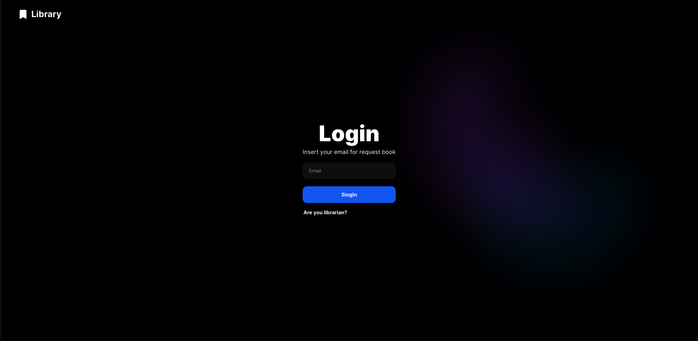
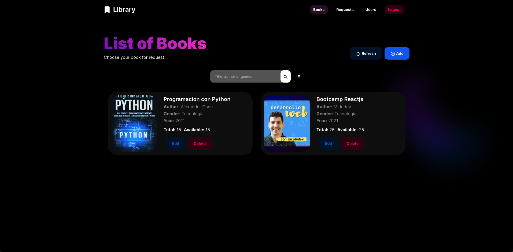
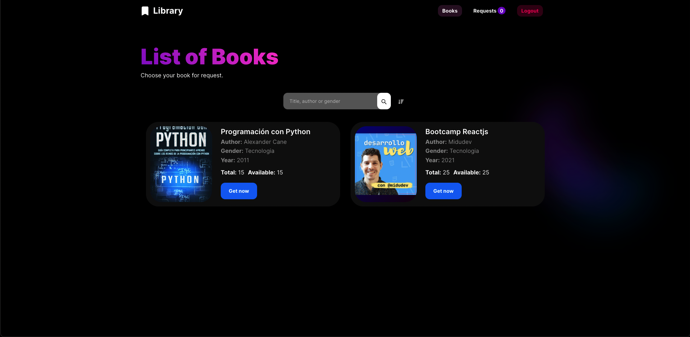

# Test Kevin Rivas

## BACKEND

The backend is a simple REST API that is used to communicate with the frontend.

### Install dependencies

```bash
cd ./backend
yarn install
```

if your use npm:

```bash
npm install
```

### Configure environment variables

rename `.env.example` to `.env` and fill in the values.

### Run the server

```bash
yarn dev
```

if your use npm:

```bash
npm run dev
```

Now you can access the server at `http://localhost:8080`.

## Documentation

The documentation API can retrieve it in postman with the export file `API_DOCUMENTAION.postman_collection.json`.

**NOTE 1:**

If Server not run the first time, you need to restart the server, This happens because sequilize does not generate the models yet.

**NOTE 2:**

The server print the admin and student role in the console.

## FRONTEND

The frontend is a simple React application created with [Vitejs](https://vitejs.dev/) that is used to communicate with the backend.

### Install dependencies

```bash
cd ./frontend
yarn install
```

if your use npm:

```bash
npm install
```

### Configure environment variables

rename `.env.example` to `.env` and fill in the values.

### Run the server

```bash
yarn dev
```

if your use npm:

```bash
npm run dev
```

Now you can access the server at `http://localhost:3000`.

## Preview







### Credits

[Portfolio](https://kevin-rivas.vercel.app)

[Linkedin](https://www.linkedin.com/in/kevin-rivas-frontend-developer/)

Create with Love ❤️ by [Kevin Rivas](https://kevin-rivas.vercel.app).
